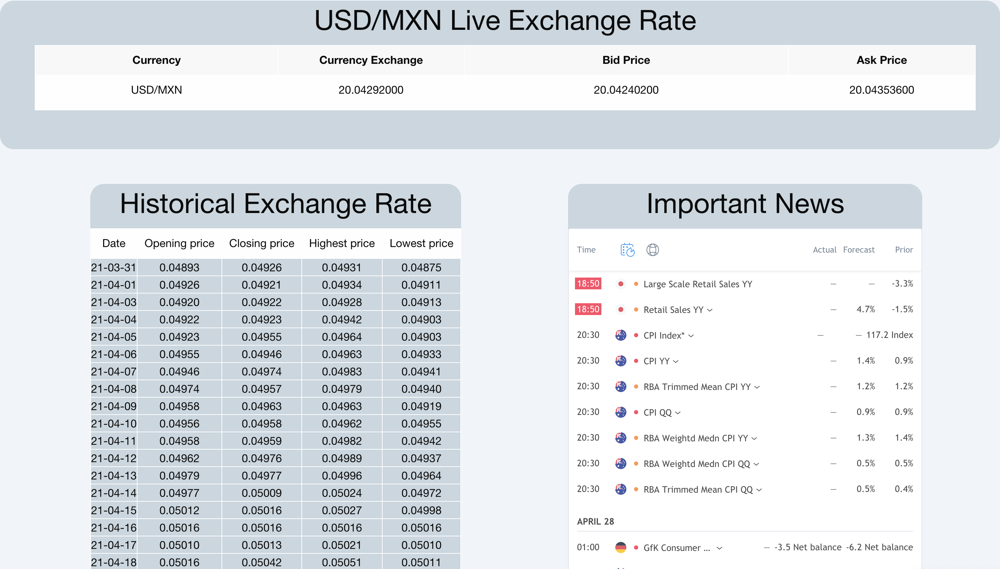

# BM-Trade-Analysis

## User Story
```
AS A Trader
I WANT to know the exchange rate from USD/MXN and be able to
see the news that impact the exchange rate
SO THAT I can make informed trading decisions
```
Page functionality
```
GIVEN a get a dashboard with information from the exchange rate from USD/MXN
WHEN I use the search bar to find important news
THEN I am presented with the news
WHEN I see the table where the actual exchange rate is shown
THEN I get a real time exchange rate
WHEN I see the historical exchange rate
THEN I get a daily update of how the exchange rate changed
WHEN I see the relevant news that impact the exchange rate
THEN I get a table with news from different countries
WHEN I am presented with a daily chart of how the exchange rate fluctuate
THEN I get a real time graph of the USD/MXN
```
Why the page was created?
```
This webpage was created with the idea of helping traders to make informed decisions while operating in the FOREX market. Most of the times, when trying to look for information of the exchange rate USD/MXN, traders face the problem that the information is incomplete or hard to find. Mainly because the main trade information webpages focus on bigger markets, and since the Mexican market is not that huge, it doesn't has that visibility.
```
Problem solved
```
By gathering this trading information from different API's and widgets, the trader will have a more efficient access to this data, making the trading decisions more informed and all of this can be found in an user-friendly webpage.
```
Code used
```
The functionality of the page was made mainly with JavaScript, we gather the information with "fetch" from two different API's. One API was used to have a realtime exchange rate, but it can only be updated every 3 minutes, because we were only able to use a free version. The second API was used to gather the historical exchange rate, this API get's updated daily, adding new rows to the webpage each day.
The CSS-Framework used was "Foundation" we took a header, a table format and a contact form from this framework, this made the responsive coding more easier to implement.
```
Image from the webpage
